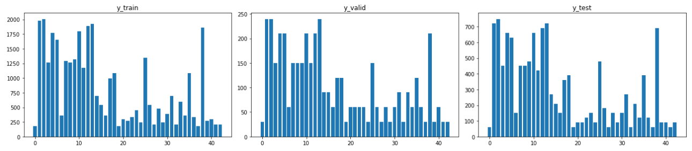
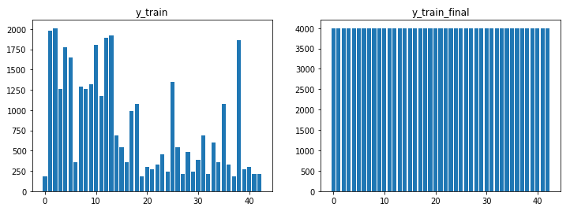
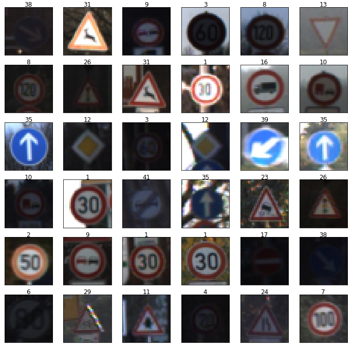
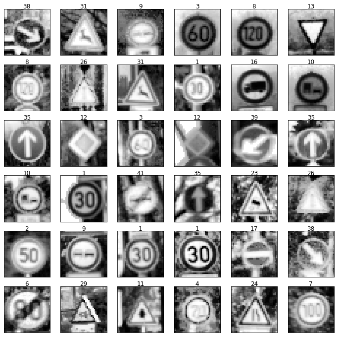
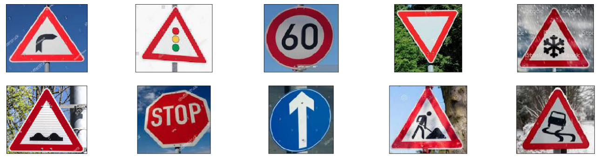
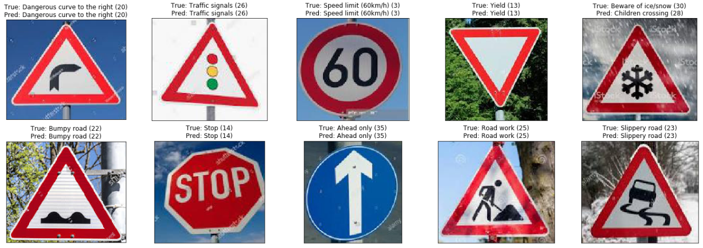

## Project: Build a Traffic Sign Recognition Program
[](http://www.udacity.com/drive)

Overview
---
In this project, we use what you've learned about deep neural networks and convolutional neural networks to classify traffic signs. We train and validate a model so it can classify traffic sign images using the [German Traffic Sign Dataset](http://benchmark.ini.rub.de/?section=gtsrb&subsection=dataset). After the model is trained, try out model on images of German traffic signs that you find on the web.

**Note**: This project is in `Traffic_Sign_Classifier.ipynb` jupyter notebook.


Libraries Required
---
* Python 3.x
* TensorFlow 1.x
* numpy
* opencv
* matplotlib
* skimage
* pandas


The Project
---
The goals / steps of this project are the following:
* Load the data set
* Explore, summarize and visualize the data set
* Design, train and test a model architecture
* Use the model to make predictions on new images
* Analyze the softmax probabilities of the new images
* Summarize the results with a written report

## Load The Dataset

The data is under folder `traffic-signs-data` and already resized with 32x32x3 (RGB values).

## Data Explore

### Data Augmentation

Original Data Distribution:



The labels in training data does not have same probilities, some classes have much more classes than others.

We use data augmentation with opencv `cv2.warpAffine()`.

```python
image_rotation = cv2.warpAffine(image, rot_mat, image.shape[1::-1], flags=cv2.INTER_LINEAR)
image_translation = cv2.warpAffine(image, translate_mat, image.shape[1::-1], flags=cv2.INTER_LINEAR)
```
The rotation image is slightly random rotated (from -10 degress to 10 degress) from the original image.
The translation image is slightly moved up/down and left/right with 3 pixels.

After data augmentation (4000 images in each class):



For more data augmentation details, see `data_augment()` function in jupyter notebook.

### Data Preprocessing

Original Images



Original images have some issues, some original images are too dark (low lightness).

- The image is turned to gray scale to reduce noise
- Tune the contrast of image

After preprocessing, the images is as below:



**Note**: this step will change shape 32x32x3 to 32x32 (grayscale).

### Data Normalization

The image data should be normalized so that the data has mean zero and equal variance.

For image data, (pixel - 128)/ 128 is a quick way to approximately normalize the data and can be used in this project.

## CNN model

Layers | Input | Output | Activation | Filter
---|---|---|---|---
conv1 | 32x32x1 | 32x32x8 | relu | 3x3
conv2 | 32x32x8 | 32x32x8 | relu | 3x3
maxpool1 | 32x32x8 |  16x16x8 |  | 2x2
conv3 | 16x16x8 | 16x16x16 | relu | 3x3
conv4 | 16x16x16 | 16x16x16 | relu | 3x3
maxpool2 | 16x16x16 |  8x8x16 |  | 2x2
conv5 | 8x8x16 | 8x8x32 | relu | 3x3
conv6 | 8x8x16 | 8x8x32 | relu | 3x3
conv7 | 8x8x32 | 8x8x8 | relu | 1x1
flat-fc | 512 | 43 | 

The training time took about 5 minutes on NVIDIA GTX 1060 GPU with 20 epochs.

The model can reach to about 94~95% accuracy on validation images after 20 epochs.

**Note**: Actually we can add some dropout after some convolutional layers and training more time or use a better GPU.

## Prediction on downloaded images

Here we do not use test images from the data, instead, we have download 10 images from web (google) to `real-world-data` folder:



These images above are not labelled, we need to label then corresponding to `signnames.csv`.

Then we predict the label and get the prediction:



The accuracy on 10 test images are 90%.

## Calculate top 5 softmax probilities

Use `tf.nn.softmax()` and `tf.nn.topk()` to get softmax probabilities.


